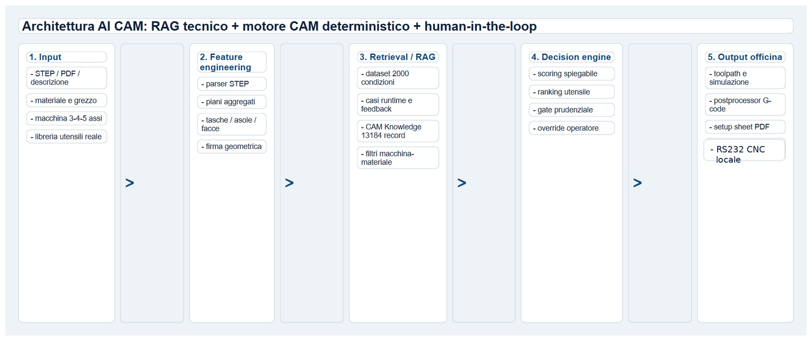
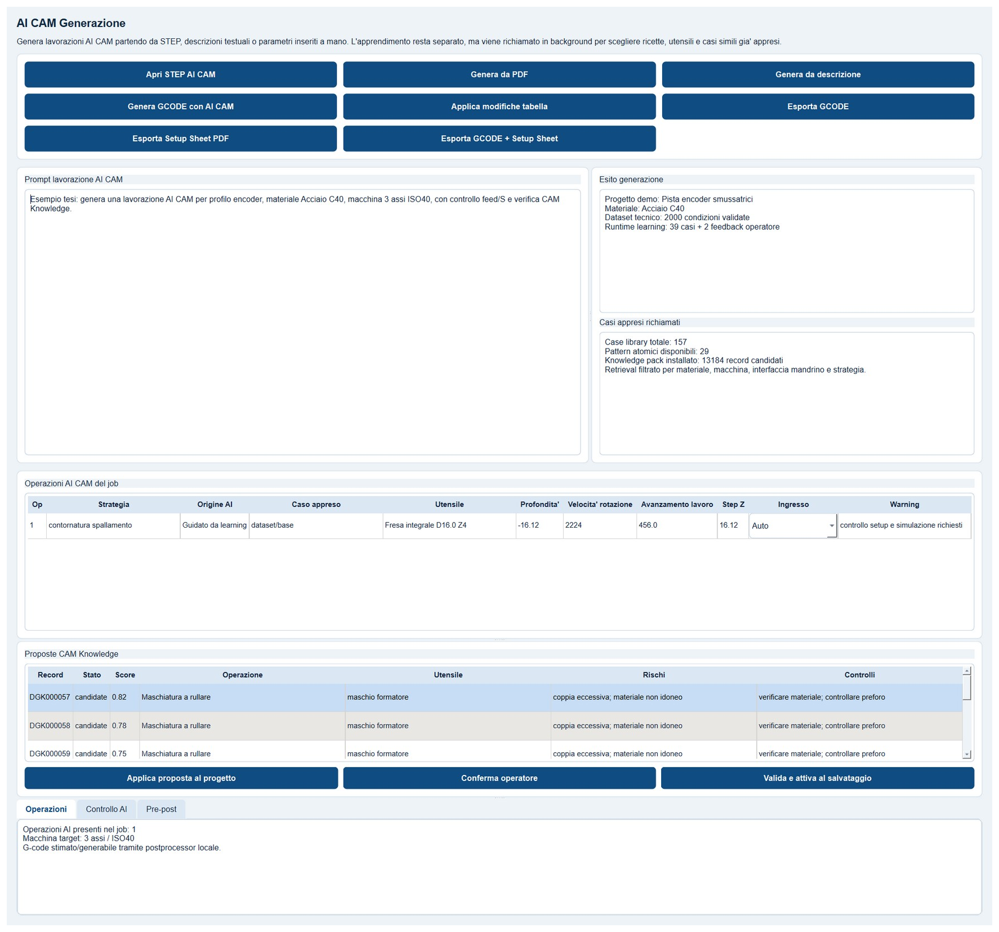
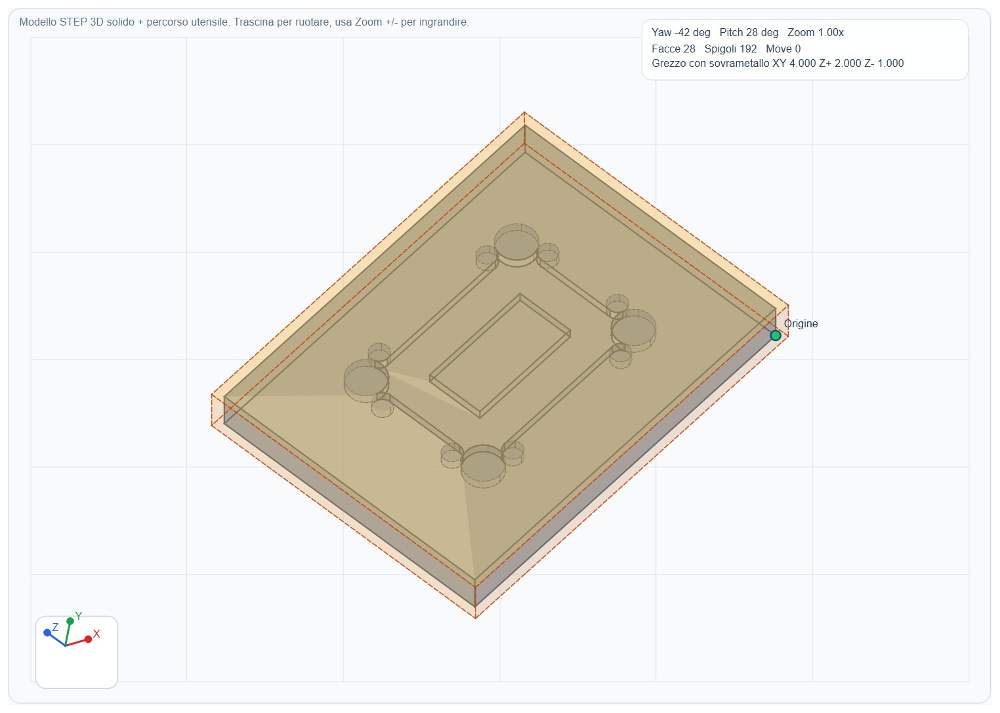
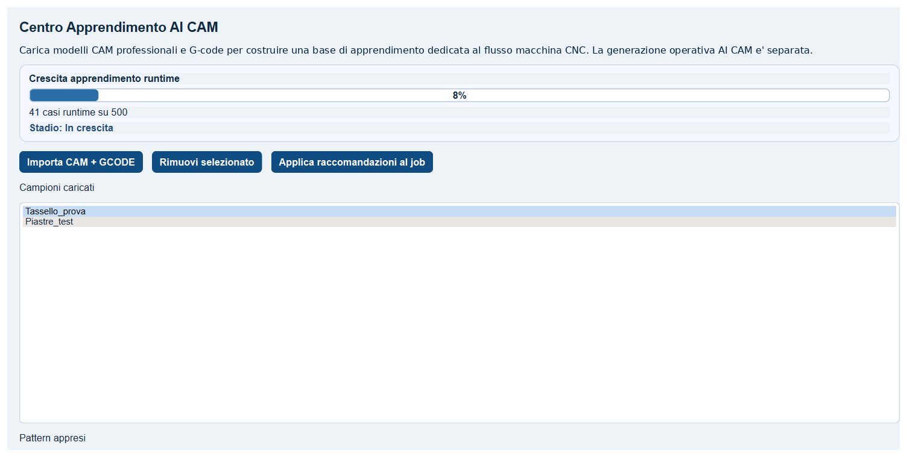

# DirectGCode AI CAM Technical Thesis

Independent technical research on AI-assisted CAM workflows for CNC programming.

This repository is a public, non-commercial publication package for the DirectGCode independent technical thesis. It is intended for professional sharing on LinkedIn, CVs, personal websites, technical portfolios, and engineering discussions.

The repository does not contain proprietary source code, internal algorithms, full datasets, complete knowledge packs, customer data, machine programs, or confidential project assets.

## Documents

| File | Description |
| --- | --- |
| [DirectGCode_Tesi_Tecnica_Indipendente.pdf](docs/DirectGCode_Tesi_Tecnica_Indipendente.pdf) | Full public thesis in Italian. |
| [Executive_Edition.pdf](docs/Executive_Edition.pdf) | Concise executive edition for quick technical review. |

## Project Description

DirectGCode explores a controlled AI CAM architecture for CNC programming. The thesis describes how an industrial CAM workflow can combine deterministic CAM logic, local knowledge retention, case retrieval, operator feedback, and AI-assisted decision support without turning the AI system into an uncontrolled generator of machine code.

The core idea is practical: AI should support CAM decisions by proposing strategies, tools, parameters, warnings, and reusable cases, while the operator remains responsible for validation and final release.

## Industrial Context

CNC programming is not only a software translation problem. It is a sequence of technical decisions involving geometry, material behavior, tool availability, setup rigidity, machining strategy, machine constraints, quality requirements, and shop-floor experience.

Traditional CAM systems are powerful, but much of the real decision-making remains inside the operator's experience. DirectGCode investigates how that know-how can be made more structured, traceable, reusable, and governable.

## Objectives

- Support CAM programmers with explainable AI-assisted recommendations.
- Preserve human control over safety-critical production decisions.
- Keep operational logic local where industrial confidentiality and continuity matter.
- Separate public documentation from proprietary implementation details.
- Build a foundation for controlled learning from cases, feedback, and validated experience.
- Improve traceability across input, AI proposal, operator review, deterministic CAM generation, validation, and shop-floor output.

## General Architecture

The thesis presents DirectGCode as a layered system: user interface, AI/CAM services, deterministic CAM core, local knowledge storage, validation, postprocessing, and optional headless/API components.

The architecture is designed around separation of responsibilities. AI components assist with ranking, retrieval, warnings, and proposals; deterministic CAM components remain responsible for controlled toolpath generation, postprocessing, and validation.

## Human-In-The-Loop Principles

DirectGCode is based on a Human-In-The-Loop operating model:

- AI proposals are treated as suggestions, not commands.
- The operator can review, edit, accept, reject, or override recommendations.
- Critical outputs require validation before export.
- Warning signals are part of the decision process, not secondary UI noise.
- Learning is separated from immediate production authority.
- Traceability matters as much as automation.

## AI CAM

The AI CAM layer connects technical context with machining decisions. It can reason over geometry, materials, operations, tool families, machining risks, reusable patterns, and validated cases.

In the thesis, AI CAM is not described as a single black-box model. It is a composed system that may include geometric feature engineering, retrieval, scoring, ranking, parameter suggestions, fallback heuristics, and manual review.

## STEP And Toolpath Visualization

The project includes visual support for reading geometry and checking machining intent before output generation.

Visualization helps the operator inspect what the system intends to do. This is essential because a CNC program is not just data; it is a physical action in a real machine environment.

## Industrial RAG

DirectGCode adapts the idea of retrieval-augmented generation to an industrial CAM context. Instead of retrieving only text, the system can retrieve cases, technical records, machining patterns, warnings, and validated conditions relevant to the current job.

This form of industrial RAG is useful only when it remains explainable:

- Why was a case retrieved?
- Which material, feature, tool, or operation made it relevant?
- What risks or warnings are attached?
- Has the case been validated by an operator or shop-floor result?

## Controlled Learning

Learning is treated as knowledge retention, not uncontrolled self-training. The thesis separates base datasets, runtime cases, operator feedback, imported professional samples, and candidate knowledge records.

This separation helps prevent local errors from contaminating trusted knowledge. It also allows the system to distinguish between public logic, customer-specific experience, internal know-how, and validated production patterns.

## AI Governance

AI governance is embedded in the architecture through practical engineering choices:

- Local-first operation for sensitive production workflows.
- Human approval for critical outputs.
- Feature flags for progressive activation.
- Shadow mode for unvalidated learning components.
- Separate memories for base data, feedback, runtime cases, and knowledge candidates.
- Reversible updates and controlled versioning.
- Reduced network exposure for machine-related functions.

## Roadmap

Future development directions described in the thesis include:

- Broader validation on real industrial jobs and materials.
- More advanced simulation and machine-envelope checks.
- Progressive API and containerization of separable services.
- Safer update, rollback, and versioning mechanisms for knowledge packs and models.
- Expanded explainability for AI CAM recommendations.
- Stronger integration with shop-floor documentation and quality workflows.
- Controlled evolution toward scalable industrial deployment.

## Disclaimer

- This is not a university thesis.
- This repository does not constitute or claim an academic degree.
- The work represents independent technical research by Lorenzo Marsico.
- No proprietary source code, internal algorithms, full datasets, complete knowledge packs, customer data, or confidential project information are disclosed.
- The included material is a public, professional, non-commercial documentation package.

## License

This repository is licensed under the Creative Commons Attribution-NonCommercial-NoDerivatives 4.0 International License.

See [LICENSE](LICENSE) and the official license page: <https://creativecommons.org/licenses/by-nc-nd/4.0/>.
